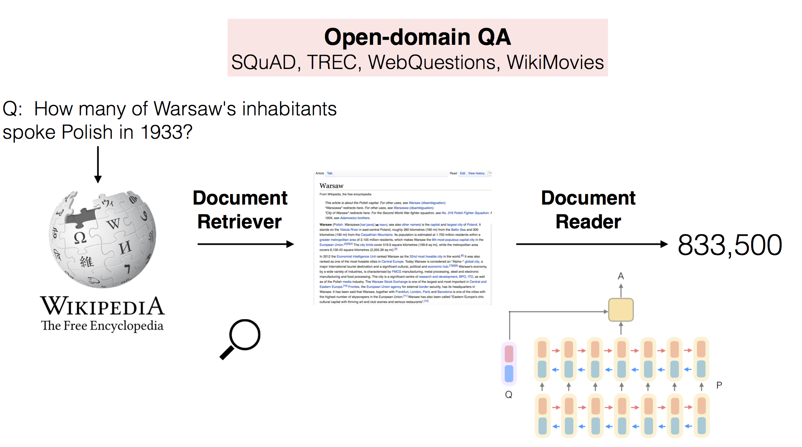

# DrQA
This is a PyTorch implementation of the DrQA system described in the ACL 2017 paper [Reading Wikipedia to Answer Open-Domain Questions](https://arxiv.org/abs/1704.00051).

## Quick Links

- [About](#machine-reading-at-scale)
- [Demo](#quick-start-demo)
- [Installation](#installing-drqa)
- [Components](#drqa-components)

## Machine Reading at Scale

<p align="center"></p>

DrQA is a system for reading comprehension applied to open-domain question answering. In particular, DrQA is targeted at the task of "machine reading at scale" (MRS). In this setting, we are searching for an answer to a question in a potentially very large corpus of unstructured documents (that may not be redundant). Thus the system has to combine the challenges of document retrieval (finding the relevant documents) with that of machine comprehension of text (identifying the answers from those documents).

Our experiments with DrQA focus on answering factoid questions while using Wikipedia as the unique knowledge source for documents. Wikipedia is a well-suited source of large-scale, rich, detailed information. In order to answer any question, one must first retrieve the few potentially relevant articles among more than 5 million, and then scan them carefully to identify the answer.

Note that DrQA treats Wikipedia as a generic collection of articles and does not rely on its internal graph structure. As a result, **_DrQA can be straightforwardly applied to any collection of documents_**, as described in the retriever [README](scripts/retriever/README.md).

This repository includes code, data, and pre-trained models for processing and querying Wikipedia as described in the paper -- see [Trained Models and Data](#trained-models-and-data). We also list several different datasets for evaluation, see [QA Datasets](#qa-datasets). Note that this work is a refactored and more efficient version of the original code. Reproduction numbers are very similar but not exact.

## Quick Start: Demo

[Install](#installing-drqa) DrQA and [download](#trained-models-and-data) our models to start asking open-domain questions!

Run `python scripts/pipeline/interactive.py` to drop into an interactive session. For each question, the top span and the Wikipedia paragraph it came from are returned.

```
>>> process('What is question answering?')

Top Predictions:
+------+----------------------------------------------------------------------------------------------------------+--------------------+--------------+-----------+
| Rank |                                                  Answer                                                  |        Doc         | Answer Score | Doc Score |
+------+----------------------------------------------------------------------------------------------------------+--------------------+--------------+-----------+
|  1   | a computer science discipline within the fields of information retrieval and natural language processing | Question answering |    1917.8    |   327.89  |
+------+----------------------------------------------------------------------------------------------------------+--------------------+--------------+-----------+

Contexts:
[ Doc = Question answering ]
Question Answering (QA) is a computer science discipline within the fields of
information retrieval and natural language processing (NLP), which is
concerned with building systems that automatically answer questions posed by
humans in a natural language.
```

```
>>> process('What is the answer to life, the universe, and everything?')

Top Predictions:
+------+--------+---------------------------------------------------+--------------+-----------+
| Rank | Answer |                        Doc                        | Answer Score | Doc Score |
+------+--------+---------------------------------------------------+--------------+-----------+
|  1   |   42   | Phrases from The Hitchhiker's Guide to the Galaxy |    47242     |   141.26  |
+------+--------+---------------------------------------------------+--------------+-----------+

Contexts:
[ Doc = Phrases from The Hitchhiker's Guide to the Galaxy ]
The number 42 and the phrase, "Life, the universe, and everything" have
attained cult status on the Internet. "Life, the universe, and everything" is
a common name for the off-topic section of an Internet forum and the phrase is
invoked in similar ways to mean "anything at all". Many chatbots, when asked
about the meaning of life, will answer "42". Several online calculators are
also programmed with the Question. Google Calculator will give the result to
"the answer to life the universe and everything" as 42, as will Wolfram's
Computational Knowledge Engine. Similarly, DuckDuckGo also gives the result of
"the answer to the ultimate question of life, the universe and everything" as
42. In the online community Second Life, there is a section on a sim called
43. "42nd Life." It is devoted to this concept in the book series, and several
attempts at recreating Milliways, the Restaurant at the End of the Universe, were made.
```

```
>>> process('Who was the winning pitcher in the 1956 World Series?')

Top Predictions:
+------+------------+------------------+--------------+-----------+
| Rank |   Answer   |       Doc        | Answer Score | Doc Score |
+------+------------+------------------+--------------+-----------+
|  1   | Don Larsen | New York Yankees |  4.5059e+06  |   278.06  |
+------+------------+------------------+--------------+-----------+

Contexts:
[ Doc = New York Yankees ]
In 1954, the Yankees won over 100 games, but the Indians took the pennant with
an AL record 111 wins; 1954 was famously referred to as "The Year the Yankees
Lost the Pennant". In , the Dodgers finally beat the Yankees in the World
Series, after five previous Series losses to them, but the Yankees came back
strong the next year. On October 8, 1956, in Game Five of the 1956 World
Series against the Dodgers, pitcher Don Larsen threw the only perfect game in
World Series history, which remains the only perfect game in postseason play
and was the only no-hitter of any kind to be pitched in postseason play until
Roy Halladay pitched a no-hitter on October 6, 2010.
```

Try some of your own! Of course, DrQA might provide alternative facts, so enjoy the ride.

## Installing DrQA

_Setting up DrQA is easy!_

DrQA requires Linux/OSX and Python 3.5 or higher. It also requires installing [PyTorch](http://pytorch.org/) version 1.0. Its other dependencies are listed in requirements.txt. CUDA is strongly recommended for speed, but not necessary.

Run the following commands to clone the repository and install DrQA:

```bash
git clone https://github.com/facebookresearch/DrQA.git
cd DrQA; pip install -r requirements.txt; python setup.py develop
```

Note: requirements.txt includes a subset of all the possible required packages. Depending on what you want to run, you might need to install an extra package (e.g. spacy).

If you use the CoreNLPTokenizer or SpacyTokenizer you also need to download the Stanford CoreNLP jars and spaCy `en` model, respectively. If you use Stanford CoreNLP, have the jars in your java `CLASSPATH` environment variable, or set the path programmatically with:

```python
import drqa.tokenizers
drqa.tokenizers.set_default('corenlp_classpath', '/your/corenlp/classpath/*')
```

**IMPORTANT: The default [tokenizer](#tokenizers) is CoreNLP so you will need that in your `CLASSPATH` to run the README examples.**

Ex: `export CLASSPATH=$CLASSPATH:/path/to/corenlp/download/*`.

If you do not already have a CoreNLP [download](https://stanfordnlp.github.io/CoreNLP/index.html#download) you can run:

```bash
./install_corenlp.sh
```

Verify that it runs:
```python
from drqa.tokenizers import CoreNLPTokenizer
tok = CoreNLPTokenizer()
tok.tokenize('hello world').words()  # Should complete immediately
```

For convenience, the Document Reader, Retriever, and Pipeline modules will try to load default models if no model argument is given. See below for downloading these models.

### Trained Models and Data

To download all provided trained models and data for Wikipedia question answering, run:

```bash
./download.sh
```

_Warning: this downloads a 7.5GB tarball (25GB untarred) and will take some time._

This stores the data in `data/` at the file paths specified in the various modules' defaults. This top-level directory can be modified by setting a `DRQA_DATA` environment variable to point to somewhere else.

Default directory structure (see [embeddings](scripts/reader/README.md#note-on-word-embeddings) for more info on additional downloads for training):
```
DrQA
├── data (or $DRQA_DATA)
    ├── datasets
    │   ├── SQuAD-v1.1-<train/dev>.<txt/json>
    │   ├── WebQuestions-<train/test>.txt
    │   ├── freebase-entities.txt
    │   ├── CuratedTrec-<train/test>.txt
    │   └── WikiMovies-<train/test/entities>.txt
    ├── reader
    │   ├── multitask.mdl
    │   └── single.mdl
    └── wikipedia
        ├── docs.db
        └── docs-tfidf-ngram=2-hash=16777216-tokenizer=simple.npz
```

Default model paths for the different modules can also be modified programmatically in the code, e.g.:

```python
import drqa.reader
drqa.reader.set_default('model', '/path/to/model')
reader = drqa.reader.Predictor()  # Default model loaded for prediction
```

#### Document Retriever

TF-IDF model using Wikipedia (unigrams and bigrams, 2^24 bins, simple tokenization), evaluated on multiple datasets (test sets, dev set for SQuAD):

| Model | SQuAD P@5 | CuratedTREC P@5 | WebQuestions P@5 | WikiMovies P@5 | Size |
| :---: | :-------: | :-------------: | :--------------: | :------------: | :---: |
| [TF-IDF model](https://dl.fbaipublicfiles.com/drqa/docs-tfidf-ngram%3D2-hash%3D16777216-tokenizer%3Dsimple.npz.gz) | 78.0 | 87.6 | 75.0 | 69.8 | ~13GB |

_P@5 here is defined as the % of questions for which the answer segment appears in one of the top 5 documents_.

#### Document Reader

Model trained only on SQuAD, evaluated in the SQuAD setting:

| Model | SQuAD Dev EM | SQuAD Dev F1 | Size |
| :---: | :-----------:| :----------: | :--: |
| [Single model](https://dl.fbaipublicfiles.com/drqa/single.mdl) | 69.4 | 78.9 | ~130MB |

Model trained with distant supervision without NER/POS/lemma features, evaluated on multiple datasets (test sets, dev set for SQuAD) in the full Wikipedia setting:

| Model | SQuAD EM | CuratedTREC EM | WebQuestions EM | WikiMovies EM | Size |
| :---: | :------: | :------------: | :-------------: | :-----------: | :--:
| [Multitask model](https://dl.fbaipublicfiles.com/drqa/multitask.mdl) | 29.5 | 27.2 | 18.5 | 36.9 | ~270MB |

#### Wikipedia

Our full-scale experiments were conducted on the 2016-12-21 dump of English Wikipedia. The dump was processed with the [WikiExtractor](https://github.com/attardi/wikiextractor) and filtered for internal disambiguation, list, index, and outline pages (pages that are typically just links). We store the documents in an sqlite database for which `drqa.retriever.DocDB` provides an interface.

| Database | Num. Documents | Size |
| :------: | :------------: | :-----------------: |
| [Wikipedia](https://dl.fbaipublicfiles.com/drqa/docs.db.gz) | 5,075,182 | ~13GB |

#### QA Datasets

The datasets used for DrQA training and evaluation can be found here:

- SQuAD: [train](https://rajpurkar.github.io/SQuAD-explorer/dataset/train-v1.1.json), [dev](https://rajpurkar.github.io/SQuAD-explorer/dataset/dev-v1.1.json)
- WebQuestions: [train](http://nlp.stanford.edu/static/software/sempre/release-emnlp2013/lib/data/webquestions/dataset_11/webquestions.examples.train.json.bz2), [test](http://nlp.stanford.edu/static/software/sempre/release-emnlp2013/lib/data/webquestions/dataset_11/webquestions.examples.test.json.bz2), [entities](https://dl.fbaipublicfiles.com/drqa/freebase-entities.txt.gz)
- WikiMovies: [train/test/entities](https://dl.fbaipublicfiles.com/drqa/WikiMovies.tar.gz)
(Rehosted in expected format from https://research.fb.com/downloads/babi/)
- CuratedTrec: [train/test](https://dl.fbaipublicfiles.com/drqa/CuratedTrec.tar.gz)
(Rehosted in expected format from https://github.com/brmson/dataset-factoid-curated)

##### Format A

The `retriever/eval.py`, `pipeline/eval.py`, and `distant/generate.py` scripts expect the datasets as a `.txt` file where each line is a JSON encoded QA pair, like so:

```python
'{"question": "q1", "answer": ["a11", ..., "a1i"]}'
...
'{"question": "qN", "answer": ["aN1", ..., "aNi"]}'
```

Scripts to convert SQuAD and WebQuestions to this format are included in `scripts/convert`. This is automatically done in `download.sh`.

##### Format B

The `reader` directory scripts expect the datasets as a `.json` file where the data is arranged like SQuAD:

```
file.json
├── "data"
│   └── [i]
│       ├── "paragraphs"
│       │   └── [j]
│       │       ├── "context": "paragraph text"
│       │       └── "qas"
│       │           └── [k]
│       │               ├── "answers"
│       │               │   └── [l]
│       │               │       ├── "answer_start": N
│       │               │       └── "text": "answer"
│       │               ├── "id": "<uuid>"
│       │               └── "question": "paragraph question?"
│       └── "title": "document id"
└── "version": 1.1
```

##### Entity lists

Some datasets have (potentially large) candidate lists for selecting answers. For example, WikiMovies' answers are OMDb entries while WebQuestions is based on Freebase. If we have known candidates, we can impose that all predicted answers must be in this list by discarding any higher scoring spans that are not.

## DrQA Components

### Document Retriever

DrQA is not tied to any specific type of retrieval system -- as long as it effectively narrows the search space and focuses on relevant documents.

Following classical QA systems, we include an efficient (non-machine learning) document retrieval system based on sparse, TF-IDF weighted bag-of-word vectors. We use bags of hashed n-grams (here, unigrams and bigrams).

To see how to build your own such model on new documents, see the retriever [README](scripts/retriever/README.md).

To interactively query Wikipedia:

```bash
python scripts/retriever/interactive.py --model /path/to/model
```

If `model` is left out our [default model](#document-retriever-1) will be used (assuming it was [downloaded](#installing-drqa)).

To evaluate the retriever accuracy (% match in top 5) on a dataset:

```bash
python scripts/retriever/eval.py /path/to/format/A/dataset.txt --model /path/to/model
```

### Document Reader

DrQA's Document Reader is a multi-layer recurrent neural network machine comprehension model trained to do extractive question answering. That is, the model tries to find the answer to any question as a text span in one of the returned documents.

The Document Reader was inspired by, and primarily trained on, the [SQuAD](https://arxiv.org/abs/1606.05250) dataset. It can also be used standalone on such SQuAD-like tasks where a specific context is supplied with the question, the answer to which is contained in the context.

To see how to train the Document Reader on SQuAD, see the reader [README](scripts/reader/README.md).

To interactively ask questions about text with a trained model:

```bash
python scripts/reader/interactive.py --model /path/to/model
```

Again, here `model` is optional; a [default model](#document-reader-1) will be used if it is left out.

To run model predictions on a dataset:

```bash
python scripts/reader/predict.py /path/to/format/B/dataset.json --model /path/to/model
```

### DrQA Pipeline

The full system is linked together in `drqa.pipeline.DrQA`.

To interactively ask questions using the full DrQA:

```bash
python scripts/pipeline/interactive.py
```

Optional arguments:
```
--reader-model    Path to trained Document Reader model.
--retriever-model Path to Document Retriever model (tfidf).
--doc-db          Path to Document DB.
--tokenizer      String option specifying tokenizer type to use (e.g. 'corenlp').
--candidate-file  List of candidates to restrict predictions to, one candidate per line.
--no-cuda         Use CPU only.
--gpu             Specify GPU device id to use.
```

To run predictions on a dataset:

```bash
python scripts/pipeline/predict.py /path/to/format/A/dataset.txt
```

Optional arguments:
```
--out-dir             Directory to write prediction file to (<dataset>-<model>-pipeline.preds).
--reader-model        Path to trained Document Reader model.
--retriever-model     Path to Document Retriever model (tfidf).
--doc-db              Path to Document DB.
--embedding-file      Expand dictionary to use all pretrained embeddings in this file (e.g. all glove vectors to minimize UNKs at test time).
--candidate-file      List of candidates to restrict predictions to, one candidate per line.
--n-docs              Number of docs to retrieve per query.
--top-n               Number of predictions to make per query.
--tokenizer           String option specifying tokenizer type to use (e.g. 'corenlp').
--no-cuda             Use CPU only.
--gpu                 Specify GPU device id to use.
--parallel            Use data parallel (split across GPU devices).
--num-workers         Number of CPU processes (for tokenizing, etc).
--batch-size          Document paragraph batching size (Reduce in case of GPU OOM).
--predict-batch-size  Question batching size (Reduce in case of CPU OOM).
```

### Distant Supervision (DS)

DrQA's performance improves significantly in the full-setting when provided with distantly supervised data from additional datasets. Given question-answer pairs but no supporting context, we can use string matching heuristics to automatically associate paragraphs to these training examples.

>Question: What U.S. state’s motto is “Live free or Die”?
>
>Answer: New Hampshire
>
>DS Document: Live Free or Die
 **“Live Free or Die”** is the official **motto** of the **U.S. state** of _**New Hampshire**_, adopted by the **state** in 1945. It is possibly the best-known of all state mottos, partly because it conveys an assertive independence historically found in American political philosophy and partly because of its contrast to the milder sentiments found in other state mottos.

The `scripts/distant` directory contains code to generate and inspect such distantly supervised data. More information can be found in the distant supervision [README](scripts/distant/README.md).

### Tokenizers

We provide a number of different tokenizer options for convenience. Each has its own pros/cons based on how many dependencies it requires, overhead for running it, speed, and performance. For our reported experiments we used CoreNLP (but results are all similar).

Available tokenizers:
- _CoreNLPTokenizer_: Uses [Stanford CoreNLP](https://stanfordnlp.github.io/CoreNLP/) (option: 'corenlp'). We used v3.7.0. Requires Java 8.
- _SpacyTokenizer_: Uses [spaCy](https://spacy.io/) (option: 'spacy').
- _RegexpTokenizer_: Custom regex-based PTB-style tokenizer (option: 'regexp').
- _SimpleTokenizer_: Basic alpha-numeric/non-whitespace tokenizer (option: 'simple').

See the [list](drqa/tokenizers/__init__.py) of mappings between string option names and tokenizer classes.

## Citation

Please cite the ACL paper if you use DrQA in your work:

```
@inproceedings{chen2017reading,
  title={Reading {Wikipedia} to Answer Open-Domain Questions},
  author={Chen, Danqi and Fisch, Adam and Weston, Jason and Bordes, Antoine},
  booktitle={Association for Computational Linguistics (ACL)},
  year={2017}
}
```

## DrQA Elsewhere

### Connection with ParlAI
This implementation of the DrQA Document Reader is closely related to the one found in [ParlAI](https://github.com/facebookresearch/ParlAI). Here, however, the work is extended to interact with the Document Retriever in the open-domain setting. On the other hand, the implementation in ParlAI is more general, and follows the appropriate API to work in more QA/Dialog settings.

### Web UI

[Hamed Zaghaghi](https://github.com/zaghaghi/) has provided a wrapper for a [Web UI](https://github.com/zaghaghi/drqa-webui).

## License
DrQA is BSD-licensed. We also provide an additional patent grant.
